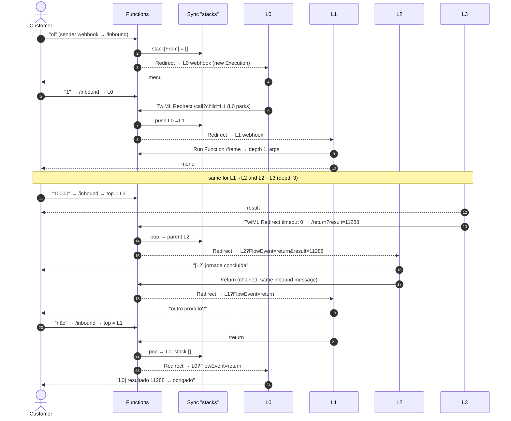
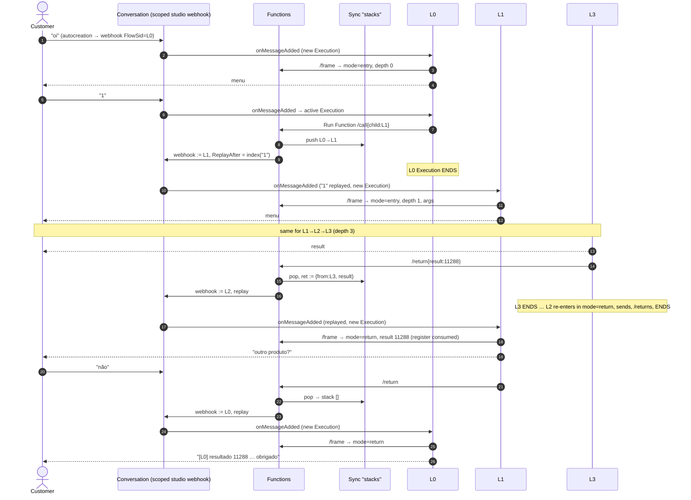

# studio-nested-flows (POC)

**Question this POC answers:**

> Can a bank compose Twilio Studio Flows **3+ levels deep** — each layer owned by a
> different team — with control **returning to the caller**, given that Studio's
> native Run Subflow widget allows **only one level of nesting**? And which of
> Twilio's two WhatsApp integration surfaces — **Programmable Messaging** or
> **Conversations (classic)** — is the better foundation for it?

Answer under test: **yes on both surfaces, by different mechanisms**, and the
mechanism is forced by the surface — so the surface choice is the real decision.

- **Scenario A · Programmable Messaging** — TwiML Redirect + `FlowEvent=return`,
  with a router Function on the sender and a Sync-backed call stack.
- **Scenario B · Conversations (classic)** — the conversation's scoped
  `studio` webhook *is* the program counter; `/call` and `/return` re-point it
  (with message replay) and every layer ends when it hands off.

Why it matters: several orchestration layers (channel → business unit →
product line → journey) sit in front of every bot, and different teams own
different layers. Teams must be able to publish their layer without touching —
or even opening — anyone else's Flow. (Context: a large bot estate being
migrated to Twilio, one team per layer.)

This is a **bite-sized feasibility POC** (README + SETUP + scripts), not a
7-tab PS engagement. If it graduates into paid work, wrap it in the 7-tab
framework (`.claude/CLAUDE.md` → "Preparing a POC").

Both scenarios share the same four Functions, the same Sync map, the same four
layers (L0 front door → L1 investimentos → L2 renda fixa → L3 rentabilidade,
pt-BR copy, identical transcript) and the same lifecycle scripts. The one
WhatsApp sender is wired for one scenario at a time; `npm run provision --
--scenario <x>` flips it.

---

## Why Run Subflow isn't enough

| | Run Subflow (native) | Scenario A — Messaging | Scenario B — Conversations |
|---|---|---|---|
| Nesting | **1 level** — subflows can't call subflows | unbounded (`MAX_DEPTH` guard) | unbounded (`MAX_DEPTH` guard) |
| Control transfer | widget | TwiML `<Redirect>` into the child's webhook | scoped studio webhook re-pointed + message **replay** |
| Return to caller | `Completed` transition, resumes mid-flow | `Return` transition on the redirect widget, resumes mid-flow | **new execution** of the parent; it branches on `mode=return` (explicit re-entry point) |
| Revision binding | parent pins the child's revision | child's webhook → its **published** revision | same |
| One Execution / one log | yes | one per level, parked while nested | one per level, **none** parked |

---

## Scenario A · Programmable Messaging

```
customer ──msg──▶ sender inbound webhook = /inbound (Function)
                     reads Sync stack[From] → <Redirect> to top-of-stack Flow, or L0
                                      ▼
   L0 ── TwiML Redirect ──▶ /call?child=L1&caller={{flow.flow_sid}}&arg_canal=…   (L0 PARKS, ≤4h)
                              push {L0→L1, args} → <Redirect> L1 webhook (new Execution, same message)
   L1 ── /frame ── menu ── TwiML Redirect ──▶ /call?child=L2…                       (L1 PARKS)
   L2 ── /frame ── menu ── TwiML Redirect ──▶ /call?child=L3…                       (L2 PARKS)
   L3 ── /frame ── asks amount ── result ── TwiML Redirect(timeout 0) ──▶ /return?result=…
                                    pop → <Redirect> L2 webhook?FlowEvent=return&result=…
   L2 resumes on "Return" ── Send Message ── TwiML Redirect(timeout 0) ──▶ /return   (chained, same message)
   L1 resumes on "Return" ── Send & Wait "outro produto?"  ◀── chain breaks: next customer message
        └── "não" ── /return ──▶ L0 resumes on "Return" ── final message. Stack empty.
```



**Layer contract (A):**
1. Entry `Trigger → incomingMessage`; the triggering body is the parent's menu reply — ignore it.
2. First widget: Run Function `/frame` (`address={{contact.channel.address}}`) → `{{widgets.get_frame.parsed.depth|parent|args.*}}`.
3. Call: TwiML Redirect, **timeout 14400**, URL `https://<fn>/call?child=<FW>&caller={{flow.flow_sid}}&arg_<k>=<v>…`. Wire **Return** → next step and read `{{widgets.<redirect>.<param>}}` (+ `returned_from`, `depth`); wire **Timeout**/**Fail** to a `/return` of your own. **Every `arg_*` / return value must be URL-safe** (tokens, numbers — no spaces, `+`, `&`, `:`): Studio does not encode Liquid output in the URL field, and an unparseable URL takes the **Fail** branch without ever calling the Function (bit us live with `whatsapp:+55…`).
4. Return: last widget = TwiML Redirect, **timeout 0**, URL `https://<fn>/return?<k>=<v>…`.

## Scenario B · Conversations (classic)

```
customer ──msg──▶ Address Configuration (autocreation → studio flow CONV L0)
                     the conversation now carries ONE scoped `studio` webhook: FlowSid = L0
                                      ▼
   L0 ── /frame (mode=entry) ── menu ── Run Function /call{child:L1, caller, arg_*} ── END
                              push {L0→L1}; webhook.FlowSid := L1 + ReplayAfter = this message's index
                              ⇒ Conversations re-delivers the same message to L1 (new Execution)
   L1 ── /frame (entry) ── menu ── /call{child:L2} ── END         (webhook := L2, replay)
   L2 ── /frame (entry) ── menu ── /call{child:L3} ── END         (webhook := L3, replay)
   L3 ── /frame (entry) ── asks amount ── result ── Run Function /return{result…} ── END
                              pop; return register := {from:L3, result…}; webhook := L2 + replay
   L2 ── /frame (mode=RETURN, result…) ── Send Message ── /return ── END    (webhook := L1 + replay)
   L1 ── /frame (mode=RETURN) ── Send & Wait "outro produto?"  ◀── next customer message
        └── "não" ── /return ── END   (pop → stack []; webhook := L0 + replay)
   L0 ── /frame (mode=RETURN) ── final message ── END.  Webhook stays on L0; nothing active.
```



**Layer contract (B):**
1. Entry `Trigger → incomingConversationMessage`.
2. First widget: Run Function `/frame` (`conversationSid={{trigger.conversation.ConversationSid}}`), then **Split on `{{widgets.get_frame.parsed.mode}}`**: `entry` → your menu; `return` → your post-call point, with the child's values at `{{widgets.get_frame.parsed.result}}` etc. (+ `from`, `depth`, and your own `args`).
3. Call: Run Function `/call` with parameters `conversationSid`, `child=<FW>`, `caller={{flow.flow_sid}}`, `arg_<k>`. **No `next` on success** — the execution ends here.
4. Return: Run Function `/return` with `conversationSid` + your values. No `next` — ends.

---

## The trade-offs (read this before choosing)

| Dimension | A · Programmable Messaging | B · Conversations (classic) |
|---|---|---|
| **Control-transfer primitive** | TwiML `<Redirect>` (Twilio re-POSTs the same message to the next URL). Studio-documented for messaging. | Conversation-scoped `studio` webhook with `ReplayAfter`. Documented fields, **but replay into a *newly pointed* Flow is the unverified bet** — see Open questions. |
| **Entry routing** | A **router Function** must own the sender webhook (`/inbound`) — the sender can point at one URL only. One more moving part on the hot path of *every* message. | **No router.** Conversations delivers to whatever the conversation's webhook says. The Functions run only on call/return. |
| **Parked executions** | One **active execution per nested level** while the customer is deep in the tree (L0, L1, L2 all parked at L3). | **None.** Every level ends when it calls or returns. Nothing to clean up between messages. |
| **Time ceiling** | TwiML Redirect `timeout` caps at **4 h**. A child conversation that outlives it orphans the parent (its Timeout branch fires; it cannot be resumed). | No ceiling from the mechanism. Studio's 30-day execution limit and the conversation's own timers apply. |
| **Resume semantics** | Parent **resumes mid-flow** on the redirect widget's Return transition — the author doesn't restructure anything. | Parent **re-enters from the trigger** and must branch on `mode=return`. Each layer carries an explicit re-entry point. More discipline, more honest. |
| **Where the "current flow" lives** | In our Sync stack (we route). | In the conversation itself (the webhook). Sync holds only frames + the return register. Observable in Console → Conversations → webhooks. |
| **Session identity** | Studio keys on **To/From** per Flow. A Messaging Service sender changes `From` and breaks matching (Studio FAQ). | Studio keys on the **Conversation SID** per Flow. Multiple participants advance the same execution. |
| **Same-message continuation** | Yes — the redirect carries the message into the child; the unwind chains several redirects on one message (**Q3 = 🟢 live**, 3 redirects + 2 sends in ~1 s). | **Yes — replay works (🟢 live 2026-10-02).** Each hop is a fresh `onMessageAdded`, not a redirect chain; the L3→L2→L1 unwind replayed twice in a row on one `10000`. |
| **Hop latency (Q6, live)** | redirect hop (`call→frame`) **p50 ≈ 380 ms**; unwind hop ≈ 0–800 ms | replay hop (`call→frame`) **p50 ≈ 450 ms**; return replay ≈ 400 ms. Customer-perceived inbound→reply: p50 2 s / p90 3 s on both |
| **Anti-loop guard (error 14107)** | **Real constraint.** Twilio fails the pair for 30 s after > 30 "replies" in 30 s — and every `<Redirect>`/`FlowEvent=return` hop counts as a reply. Deep unwinds fan one customer message into ~7 hops; a chatty customer at depth 3 can trip it (we did, at ~24 msgs/75 s). Mitigations: fewer hops per message (Send & Wait between returns), or ask Support to lift the guard. | Hops are webhook deliveries, not TwiML replies — expected not to count (**to verify in B-2**). |
| **Args down / values up** | query string + `/frame`; values on the Return transition as widget variables | Run Function params + `/frame` for both; values arrive through `/frame` on re-entry |
| **Independent publishing** | child webhook → published revision | same |
| **Execution logs** | per Flow (`npm run trace` merges) | per Flow (same) — plus the conversation's message history in one place |
| **Billing** | one Execution per level (nested execs stay alive) | one Execution per level per *visit* (a return creates a new one) — same order of magnitude, arguably cleaner |
| **Media** | Studio handles inbound media on the Messaging trigger (WhatsApp: one media) | **"Sending media is not supported when using the Conversations integration"** (Studio user guide) |
| **Abandonment** | N parked executions + stale frames. `reset` ends them; `/inbound` drops frames past `STACK_TTL_SECONDS`. | A stale webhook on an **open** conversation (points at whatever layer was last) and one Sync doc. `reset` closes the conversation. Address autocreation starts a clean conversation on the next message — but **an open conversation holds the address**, so without closing it the customer lands in the stale layer (TAC guide 10.17). |
| **Human handoff later** | Send to Flex from a Messaging-triggered flow needs a conversation to be created for it (Flex Conversations) — the TAC guide's 10.15/10.17/10.18 class of problems. | The conversation already exists; Send to Flex / Flex Interactions attach to it natively. **Strong argument for B if Flex is in the picture.** |
| **Coexistence with CO/TAC/Memora** | Sender webhook is exclusive — can't share the sender with a TAC app. | Autocreation does **not** silence the messaging webhook (verified live: both L0s answered one `oi`) — provision parks the sender webhook + Messaging Service inbound on `/noop` for B. CO's v1 bridge creates its own v1 conversations on that address — don't put this on a sender that CO captures. |
| **Reset keyword** | `reset` in `/inbound` (we see every message). | Not available (we don't see messages) — `npm run reset` only. |
| **What a layer team must know** | TwiML Redirect semantics (timeout, Return/Timeout/Fail), the URL contract. | Run Function + a `mode` split. No TwiML. Closer to how Flex flows are written. |
| **Risk profile** | Mechanism fully documented; risks are *limits* (4 h, chain depth, parked execs). | Mechanism assembled from documented parts; risk is *one empirical unknown* (replay). If it fails, fallback = REST execution + `resume-conversation` (documented, see below). |

### Caveats specific to A
- **No recursion** (one active execution per contact per Flow) — `/call` refuses a Flow already on the stack.
- **4-hour ceiling per level** — the parent's `timeout` max. `STACK_TTL_SECONDS` mirrors it so `/inbound` drops frames the parent can no longer honor.
- **Chained unwind works** (L3→L2→L1 on one inbound message, verified live) — but every hop counts toward Twilio's **14107 anti-loop guard** (> 30 replies / 30 s between the pair → 30 s of failed messages). Keep the hops-per-message low (a Send & Wait between returns resets the chain, as L1 does) and don't rely on it for high-frequency exchanges.
- **`timeout 0` does NOT end the child's execution** (verified live 2026-10-02: L1 stayed `active` after its final redirect). Left alone, the next call into that Flow lands in the parked execution and is swallowed. `END_CHILD_ON_RETURN=true` (now the default) makes `/return` end it via REST — one extra Studio call per return.
- **`FlowEvent=return` with no parked execution** behaves like a fresh trigger — only possible right after a stale drop.
- **Messaging Service senders** change the `From` Studio keys on — keep the sender's `From` stable.
- **A sender inside a Messaging Service is routed by the *service's* inbound URL**, not by the Senders-API webhook — for WhatsApp channel senders this holds even with "defer to sender's webhook" on (verified live 2026-10-02: Debugger 11210 against another demo's dead host, `/inbound` never called). Provision sets both; teardown restores both.
- **Voice** would be the *easy* case (the live call follows redirects; no router) — not built.

### Caveats specific to B
- **Replay works** (🟢 live 2026-10-02). `Configuration.ReplayAfter` on a freshly created scoped `studio` webhook re-delivers the *current* message to the newly pointed Flow, ~450 ms after `/call`. The Functions delete-then-create the webhook for exactly that reason. Side note for `trace`: Studio keys replayed (return-mode) executions on the **Conversation SID** as the contact, entry executions on the customer address.
- **Explicit re-entry.** A layer with several child calls must distinguish *which* child returned (`from`) — the `mode` split becomes a small state machine. Scenario A hides this.
- **One active execution per conversation per Flow** — re-entering L0 after the unwind requires L0's earlier execution to have ended. It has (L0 ended on `/call`), but it's the invariant `npm run trace` must show.
- **Open conversations are sticky.** Autocreation only fires for a *new* conversation. Rehearsals must close the open conversation (`npm run reset` does).
- **Default Conversations service.** Autocreated conversations land in the account's default service unless `CONVERSATIONS_SERVICE_SID` is set. On a shared demo account the default service may carry other demos' service-level webhooks — set a dedicated service if in doubt.
- **No media**, per the Studio user guide.
- **Replay fallback (documented, not built):** `/call` and `/return` create a **REST execution** on the target Flow (`POST /v2/Flows/{FW}/Executions`, values in `Parameters`); each Flow gains an `incomingRequest` branch → `resume-conversation` (service + conversation SIDs from the parameters) → the same `mode` split. This is the exact shape of the TAC handoff flow (TAC guide 10.15), so it is known to work — at the cost of ending the caller's execution via REST first (one active REST execution per contact).

### Recommendation (pre-smoke-test)
If Flex (or any Conversations-native feature) is on the roadmap, **B** is the better foundation: no parked state, no 4-hour ceiling, no router on the hot path, and the conversation is already there when a human needs it. **A** is the safer *mechanism* (fully documented) but carries the limits above into production. The smoke test decides whether B's one bet (replay) pays.

---

## Files

| Path | Purpose |
|---|---|
| `infra/studio/msg-L0…L3-*.json` | Scenario A flow templates (TwiML Redirect based). |
| `infra/studio/conv-L0…L3-*.json` | Scenario B flow templates (Run Function + `mode` split). |
| `infra/studio/rendered/` | What was actually sent to Studio on the last provision/validate (gitignored). |
| `serverless/functions/inbound.protected.js` | **A only.** The sender's webhook: stack top → that Flow, else L0. `RESET_KEYWORD`. |
| `serverless/functions/call.protected.js` | Push a frame; A: `<Redirect>` into the child · B: re-point the scoped webhook with replay. Recursion + `MAX_DEPTH` guards. |
| `serverless/functions/return.protected.js` | Pop; A: `<Redirect>` into the parent with `FlowEvent=return` · B: park values in the return register, re-point webhook to the parent with replay. |
| `serverless/functions/frame.protected.js` | Top frame (args, depth, parent) + consumes the return register (`mode`). |
| `serverless/functions/lib/stack.private.js` | Sync doc read/write, staleness, TwiML helpers, Conversations REST (webhooks, message index), execution-ending. |
| `scripts/provision.ts` | `npm run provision -- --scenario messaging\|conversations` — Sync → Functions → 8 flows → Functions vars → **sender wiring flip**. |
| `scripts/teardown.ts` | `npm run teardown [-- --apply] [--keep-flows]` — dry-run default; unwires the sender, deletes flows/Functions/Sync. |
| `scripts/reset.ts` | `npm run reset [-- --address +55… [--force]]` — end parked executions (both key kinds) + clear stacks + close open conversations **that carry our studio webhook** (never "everything on the sender" — it's shared and closed is final). **Chain first.** |
| `scripts/stack.ts` | `npm run stack` — every live stack (+ unconsumed return registers). |
| `scripts/trace.ts` | `npm run trace [-- --hours N] [--address +55…]` — merged step timeline across all 8 flows (1 s granularity). |
| `scripts/latency.ts` | `npm run latency [-- --hours N] [--address +55…]` — **Q6**: p50/p90 per hop from the Functions log (ms): A `inbound→call`, `call→frame`, `return→return`; B `call→frame` (replay), `return→frame=return`; plus customer-perceived inbound→first reply from the Messages API. |
| `scripts/validate-flows.ts` | `npm run validate-flows` — render + `POST /Flows/Validate` only (the per-layer CI check). |
| `SETUP.md` | Provisioning guide, both smoke-test transcripts, reset, teardown, symptom → fix tables. |

---

## Pass / fail criteria

| # | Claim | A pass when | B pass when |
|---|---|---|---|
| **Q1** | ≥ 3 levels with control returning to each caller | final `[L0]` message carries L3's result and `voltou de <L1 SID>`; `npm run stack` empty | same, with `· conv` tags |
| **Q2** | Layers publish independently | edit L2 text → `provision --skip-serverless --skip-wiring` bumps only L2's revision; next run shows it | same |
| **Q3** | Multi-hop unwind on one customer message | `[L2]` **and** `[L1] … outro produto?` arrive after a single `"10000"` (chained redirects) | same (chained replays) |
| **Q4** | Abandon + recover | abandon at L2; `reset` keyword or `npm run reset`; next `"oi"` starts clean | abandon at L2; `npm run reset`; next `"oi"` → **new** conversation, L0 |
| **Q5** | Nothing lingers | `trace`: no active executions on L1–L3 after a run | `trace`: **no active executions at all** between messages |
| **Q6** | Hop latency | `trace` `+ms` per `/call`, `/return` hop — record p50 | same; expect replay hops slower than redirects |
| **Q7** | Entry works | sender webhook → `/inbound` → L0 | **autocreation → L0 on the first message** (and the sender webhook is bypassed) |

## Open questions only the live run settles
- **B · replay:** does `ReplayAfter` re-deliver the current message to the newly pointed Flow? (If not → the REST + `resume-conversation` fallback above.)
- **A · chain depth:** how many `<Redirect>` hops will Messaging follow on one inbound message?
- **A · `timeout 0`:** does it end the child's execution?
- **Both:** hop latency.
